# Portfolio Projects

A small collection of projects, apps, and photography work I’ve built over the years.

## Projects

### [Proof in Bio](https://proof-in-bio.com)
**What it is:** A proof gallery for photographers to publish and share verified photos when platforms strip metadata. The site positions itself as a permanent proof page photographers can send to editors, collectors, and clients.

**Built with:** AWS, EC2, Svelte, Tailwind CSS

**What it does:** Lets photographers create a shareable gallery for authenticated images and preserve trust signals around their work.

  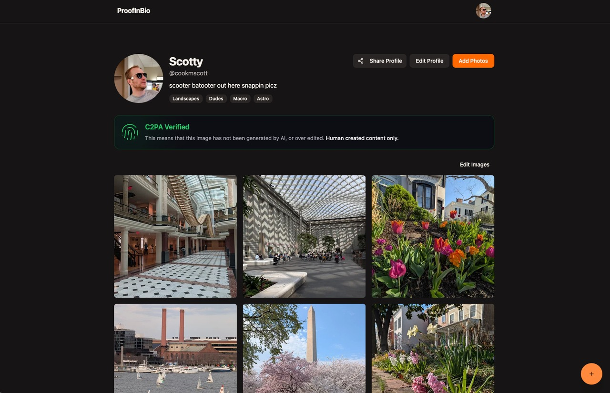
  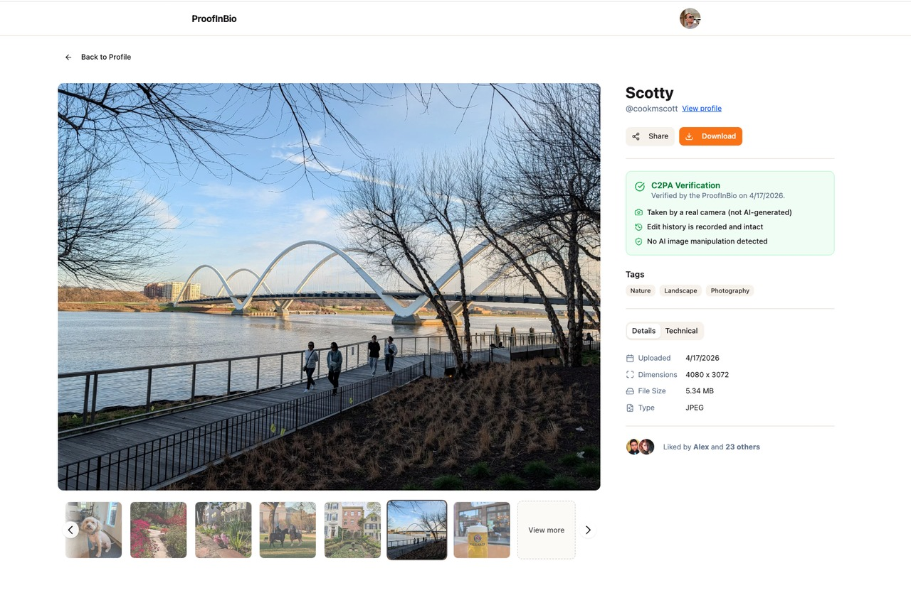
  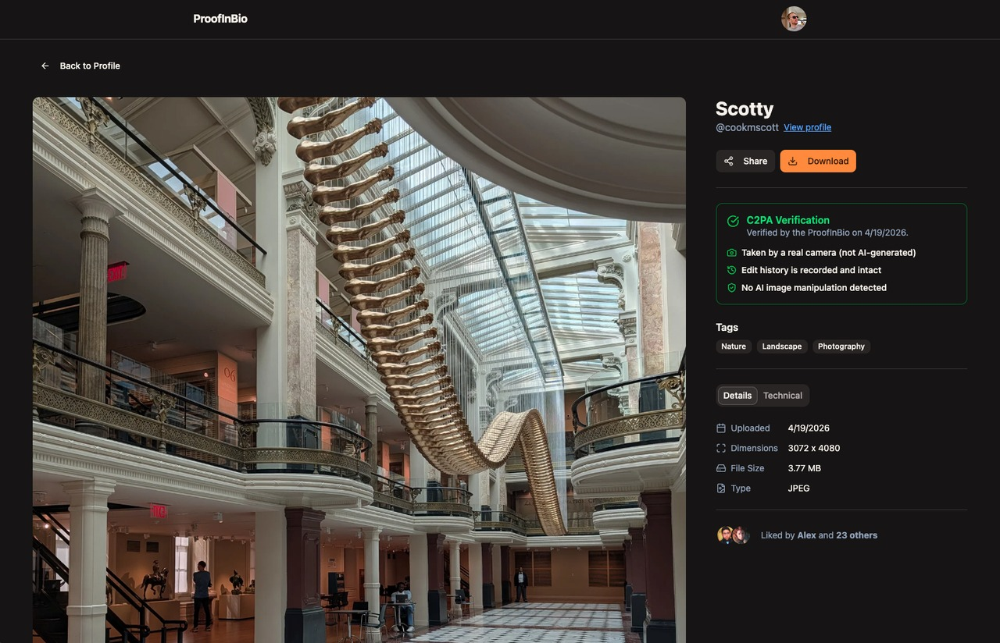

---

### [Watermarks.io](https://watermarks.io)
**What it is:** A browser-based watermarking tool for photographers and creators.

**Built with:** Vue.js, Google Cloud backend, heavy client-side photo processing

**What it does:** Lets users design and apply watermarks to one or more images, with batch export, resize, and rename workflows. The product emphasizes fast browser-based processing, auto scaling, and support for high-resolution images.

**Demo:** Featured in a friendly YouTube walkthrough by Joseph Todd: [Watch the demo](https://www.youtube.com/watch?v=Zu_nDVMKE54)

  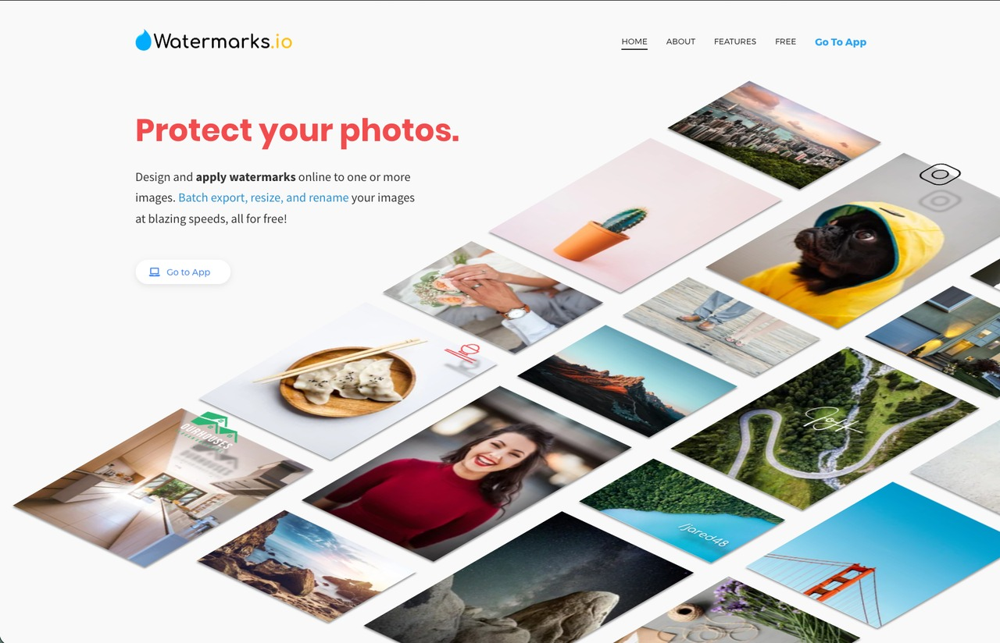
  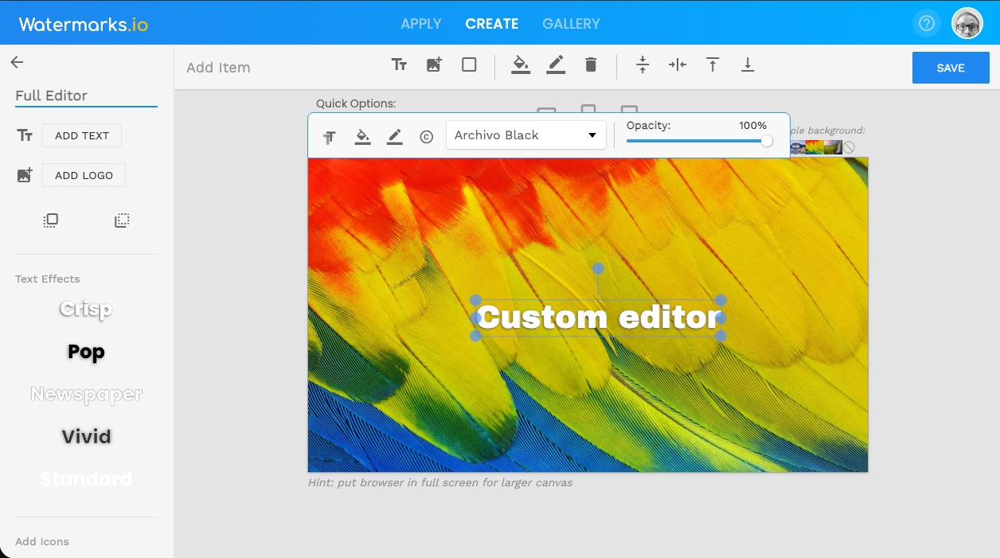
  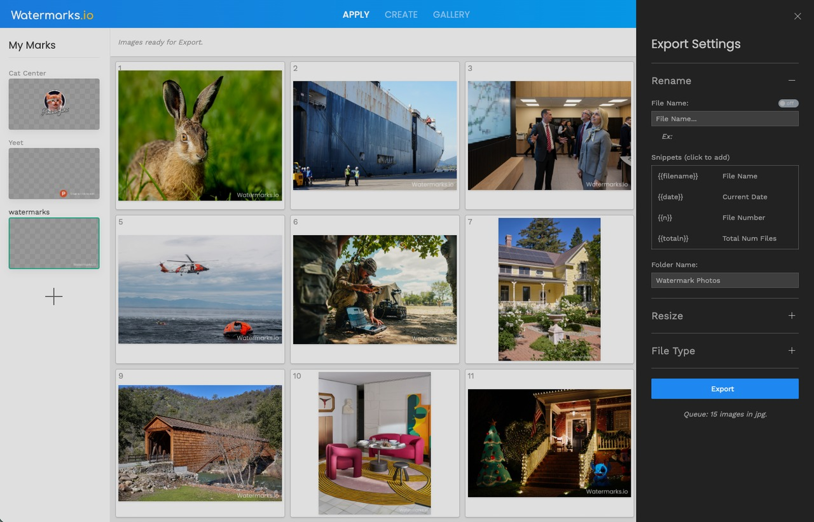

---

### LokJot App
**What it is:** A private and secure note-taking app.

**Built with:** Flutter

**What it does:** Gives users a simple place to write and manage personal notes with a focus on privacy and security.

  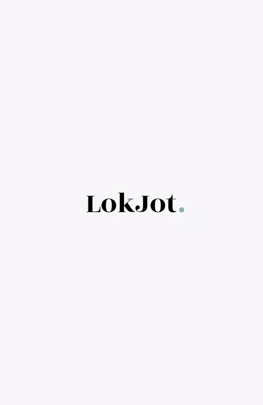
  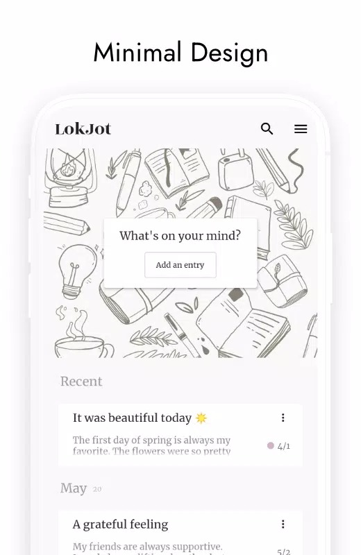
  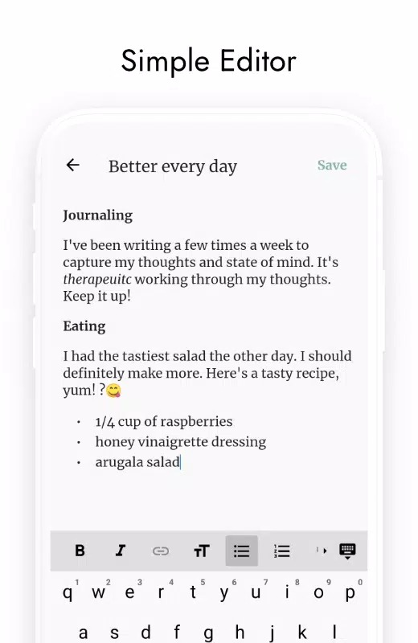

  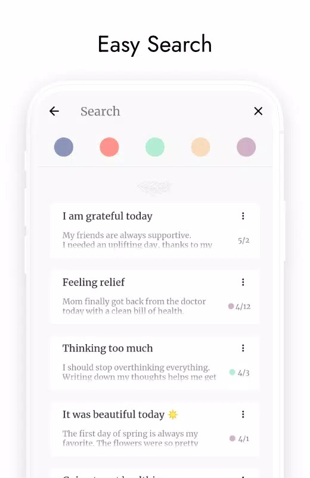
  
  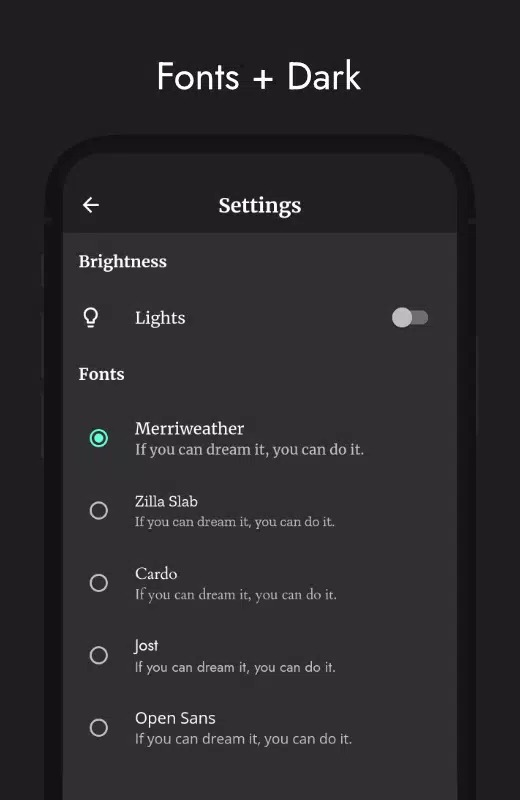

---

### [Flutter Clock Challenge Winner](https://github.com/cookmscott/FlutterClockChallenge)
**What it is:** My submission to the Flutter Clock Challenge.

**Built with:** Flutter / Dart

**What it does:** A modern 3D-inspired digital clock with playful animation and a distinctive visual style. In the repo, I describe it as a classic digital clock reimagined with a modern "flat" 3D design.

**Recognition:** My project, **Iso Clock**, was recognized in Flutter's official contest results as an **Honorable Mention**.

---

## Photography

In addition to product and app work, I’m also an award-winning photographer.

### Selected recognition

- **Exposed DC 18th Annual Contest (2024)** — recognized for **"Eastern Market"**.
- **Exposed DC 15th Annual Contest (2021)** — recognized for **"Fairy Godmother"**.
- **DC Public Library / Dig DC Archive** — **"Eastern Market"** is included in the People's Archive digital repository.

### Links
- [Exposed DC Annual Contest Archive](https://exposeddc.com/category/annual-contest/)
- [Winning Photos of the 15th Annual Exposed DC Contest](https://exposeddc.com/2021/02/03/winning-photos-of-the-15th-annual-exposed-dc-contest/)
- [Eastern Market at Dig DC / DC Public Library](https://digdc.dclibrary.org/do/acb80cd4-390e-4503-b40b-a429bb63dbd4)

---

## About Me

I like building useful, design-forward products across web, mobile, and photography workflows. My work spans frontend-heavy apps, media tools, cloud-backed products, and creative technology projects.
